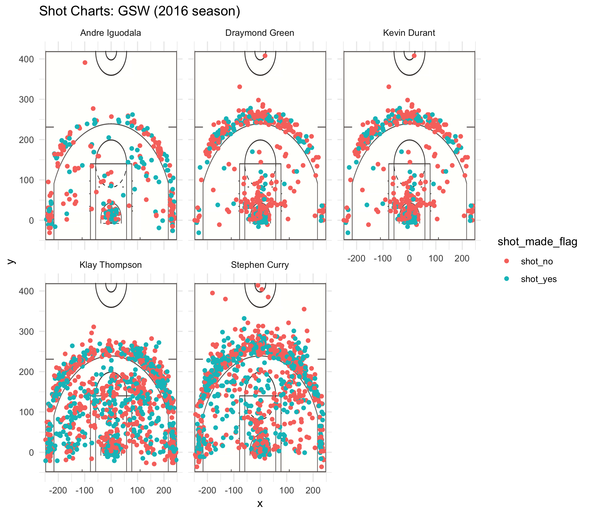

Narrative
================

According to this [article](https://sircharlesincharge.com/2019/03/13/golden-state-warriors-serious-concern/) in *Fansided*, the Golden State Warriors main weakness is their defense, as the demonstrated in their recent loss against the Phoenix Suns. It is hard to admit that the Bay Area's beloved Warriors may have any weakness at all, so I wont. Here I have analyzed only the shooting percentages of the Warriors offensive players from their legendary 2016/2017 season. Is this a thorough analysis of the Warriors overall performance as a team? Not particularly, but it does bring to light some of what makes them one of the most talked about teams in NBA history: their undeniably high shooting success rates.

The two years prior to the 2014/2015 season, the Warriors finished 6th in the league, and before that from the mid 90s until their 6th place finish in 2013, they were hanging out around 10th place overall. The 2016/2017 season was Kevin Durant’s first season with the Warriors, after playing for Oklahoma City Thunder for nine seasons, experiencing some tough losses to the Warriors during the Finals, and ultimately never winning a finals with OKC Thunder. Stephen Curry, Klay Thompson, Draymond Green, and Andre Iguodala are some of the most famous names in this new wave of Warriors fame, from what I understand as someone who sat through their first basketball game in the spring of 2015, along with what seems like the great majority of today’s Warrior fans.

Understandably so, as the Bay Area is such a hub of technology, food, and entertainment- the Warriors had to be the best in order to take the spotlight among all the other stimulation present in the area. The sports industry is ultimately a business, and the number of Warriors jerseys sported around town during May and June indicate that business is booming. This can be attributed almost completely to how fun these men are to watch. People like basketball probably for a lot of reasons, but a big one is how fast paced it is. If you leave the room to grab a beer you will have missed something, unlike soccer or football. Being a Warriors fan for the sake of entertainment is great because they keep shooting and keep making it, which is what my analysis is centered around: shooting percentages.

Below is a series of charts depicting shots made by Andre Iguodala, Draymond Green, Kevin Durant, Klay Thompson, and Stephen Curry during their 2016/2017 season. A red dot indicates that the shot did not go in, and a blue dot indicates that the shot resulted in either a two point field goal (if the dot is within the three point line that forms an ellipse encapsulating the other lines in the bottom area of each half court image) or a three point field goal “three pointer” (if the dot is behind the three point line). Free throws are not included in this data.

``` r

```


While Kevin Durant, Stephen Curry, and Klay Thompson might be the most widely known for their shooting skills, Andre Iguodala actually has the highest percentage of two point field goals made of the five players included in this analysis, with a 63.8% success rate, with Kevin Durant behind him at 60.6%. However, Durant leads the team with his overall percentage, which includes three pointers. Klay Thompson has the best three-pointer success rate at 42.2%.

    ##   name     total made perc_made
    ## A Curry    563   304  53.99%   
    ## B Durant   643   390  60.6%    
    ## C Green    346   171  49.4%    
    ## D Iguodala 210   134  63.8%    
    ## E Thompson 640   329  51.4%

    ##   name     total made perc_made
    ## A Curry    687   280  40.7%    
    ## B Durant   272   105  38.6%    
    ## C Green    232   74   31.9%    
    ## D Iguodala 161   58   36%      
    ## E Thompson 580   246  42.4%

    ##   name     total made perc_made
    ## A Curry    1250  584  46.7%    
    ## B Durant   915   495  54.1%    
    ## C Green    578   245  42.4%    
    ## D Iguodala 371   192  51.8%    
    ## E Thompson 1220  575  47.1%

| name     | total | made | perc\_made |
|:---------|:------|:-----|:-----------|
| Curry    | 563   | 304  | 53.99%     |
| Durant   | 643   | 390  | 60.6%      |
| Green    | 346   | 171  | 49.4%      |
| Iguodala | 210   | 134  | 63.8%      |
| Thompson | 640   | 329  | 51.4%      |

| name     | total | made | perc\_made |
|:---------|:------|:-----|:-----------|
| Curry    | 687   | 280  | 40.7%      |
| Durant   | 272   | 105  | 38.6%      |
| Green    | 232   | 74   | 31.9%      |
| Iguodala | 161   | 58   | 36%        |
| Thompson | 580   | 246  | 42.4%      |

| name     | total | made | perc\_made |
|:---------|:------|:-----|:-----------|
| Curry    | 1250  | 584  | 46.7%      |
| Durant   | 915   | 495  | 54.1%      |
| Green    | 578   | 245  | 42.4%      |
| Iguodala | 371   | 192  | 51.8%      |
| Thompson | 1220  | 575  | 47.1%      |
